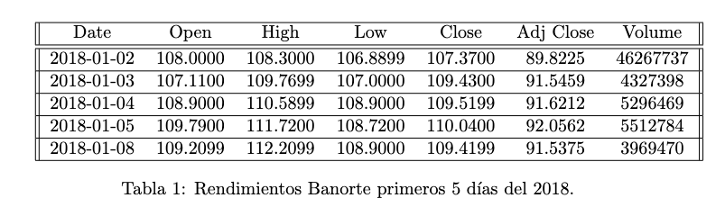

# Project: Estimation of a financial option

In this project, the development of Montecarlo simulation and Black-Scholes model was the main objetive to analyse of the financial options of Banorte, using python. 

